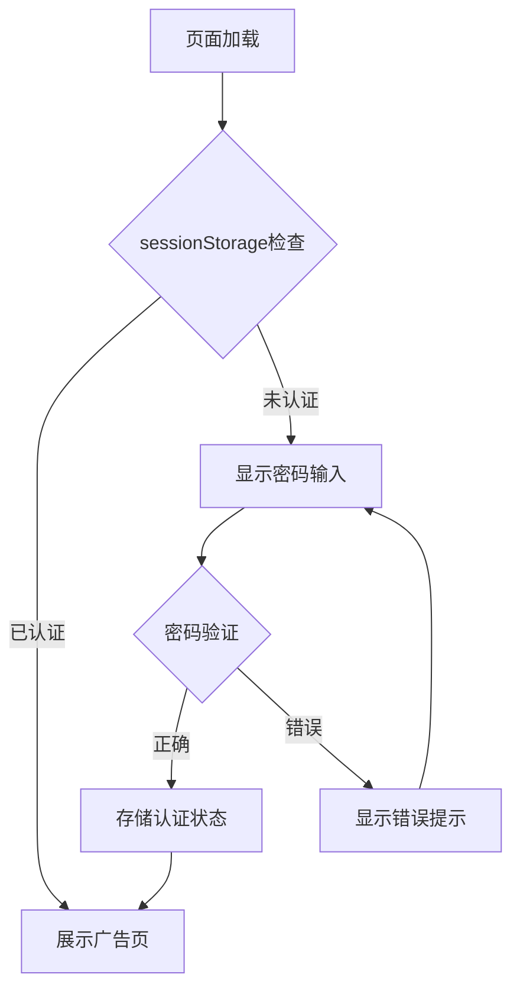

# 绍兴黄酒专卖 - 项目架构文档

## 项目概述

移动端黄酒品牌展示与商品浏览Web应用，部署于GitHub Pages。

**线上地址**: https://llkongs.github.io/family-business/

---

## 技术栈

| 类别 | 技术 |
|------|------|
| 语言 | TypeScript |
| 构建工具 | Vite 7.3 |
| 样式 | CSS (原生) |
| 部署 | GitHub Pages + Actions |

---

## 目录结构

```
family-business/
├── public/
│   └── images/
│       ├── brands/          # 品牌轮播图 (6张)
│       ├── products/        # 商品图片 (8张)
│       └── qrcode.jpg       # 二维码
├── src/
│   ├── data/
│   │   ├── mockData.ts      # 店铺/商品数据
│   │   ├── types.ts         # TypeScript类型
│   │   └── productDatabase.json  # 完整商品数据库
│   ├── pages/
│   │   ├── AdDisplay.ts     # 广告展示页
│   │   └── ProductMenu.ts   # 商品菜单页
│   ├── main.ts              # 应用入口 + 密码保护
│   └── style.css            # 全局样式
├── .github/workflows/
│   └── deploy.yml           # CI/CD自动部署
└── vite.config.ts           # Vite配置
```

---

## 核心模块

### 1. 密码保护层 (`main.ts`)



### 2. 页面路由 (`main.ts`)

| 页面 | 组件 | 功能 |
|------|------|------|
| `ad` | AdDisplay | 品牌轮播、店铺信息、入口按钮 |
| `menu` | ProductMenu | 商品分类、商品列表、详情弹窗 |

### 3. 广告展示页 (`AdDisplay.ts`)

**功能模块**:
- 顶部栏: 店铺名称、电话、二维码
- 品牌轮播: 6张图片，Ken Burns动画效果
- 导航组件: 左右箭头、圆点指示器、品牌标签
- 入口按钮: 跳转商品菜单

### 4. 商品菜单页 (`ProductMenu.ts`)

**功能模块**:
- 左侧分类导航: 6个分类
- 右侧商品列表: 滚动时自动高亮分类
- 商品详情弹窗: 点击商品卡片展示

---

## 数据模型

### 商品 (Product)

```typescript
interface Product {
  id: string;           // 商品ID
  categoryId: string;   // 分类ID
  name: string;         // 商品名称
  description: string;  // 描述
  price: number;        // 价格
  image: string;        // 图片URL
}
```

### 完整数据库字段 (`types.ts`)

- 基础: SKU、条形码、品牌
- 规格: 容量、单位、包装规格
- 价格: 零售价、成本价、会员价
- 库存: 数量、安全库存、仓位
- 酒类特有: 酒精度、年份、酿造工艺

---

## 安全措施

| 措施 | 说明 |
|------|------|
| 密码保护 | 客户端密码门，sessionStorage存储认证状态 |
| CSS水印 | 商品图片显示"AI效果图"水印 |
| 弹窗水印 | 详情弹窗显示"AI生成效果展示" |

---

## 部署流程


**配置文件**: `.github/workflows/deploy.yml`

---

## 配置说明

### Vite配置 (`vite.config.ts`)

```typescript
export default defineConfig({
  base: '/family-business/',  // GitHub Pages子路径
  build: {
    outDir: 'dist',
    minify: 'esbuild'
  }
})
```

### 图片路径

使用 `import.meta.env.BASE_URL` 确保GitHub Pages正确解析:

```typescript
const BASE_URL = import.meta.env.BASE_URL;
image: `${BASE_URL}images/products/xxx.png`
```

---

## 商品内容

### 品牌 (3个)
- 古越龙山
- 会稽山  
- 女儿红

### 分类 (6个)
| 图标 | 分类 |
|------|------|
| 🔥 | 热销推荐 |
| 🏺 | 花雕酒 |
| 🍚 | 加饭酒 |
| 🎀 | 女儿红 |
| 🎁 | 礼盒装 |
| 🫙 | 坛装酒 |

### 商品 (10个)
AI生成商品图片，无版权问题。
